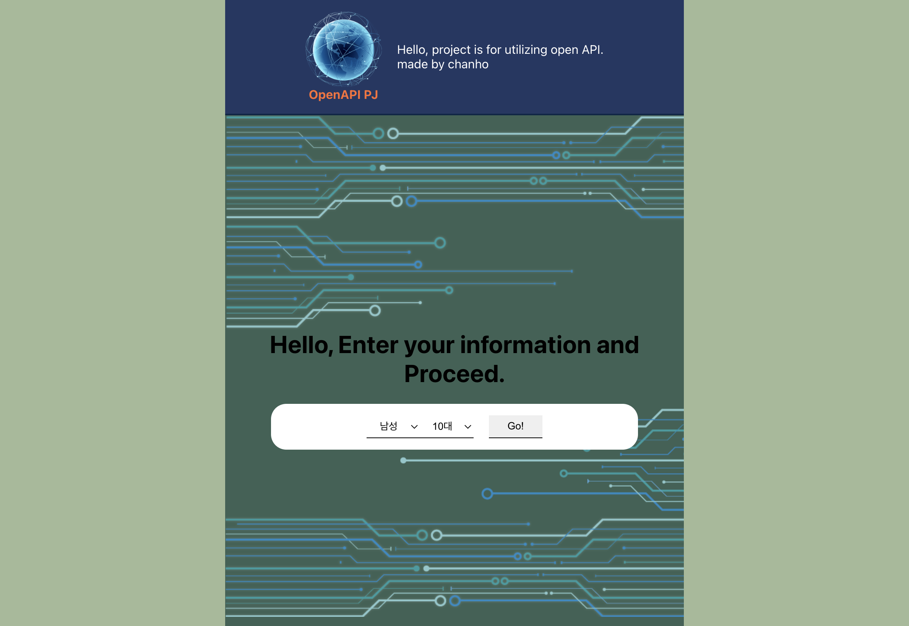
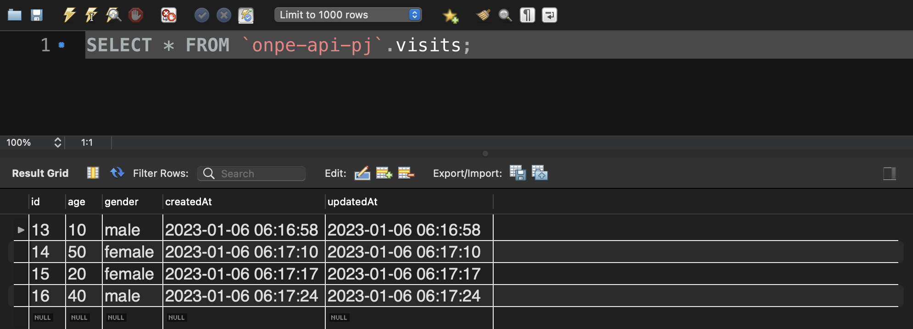
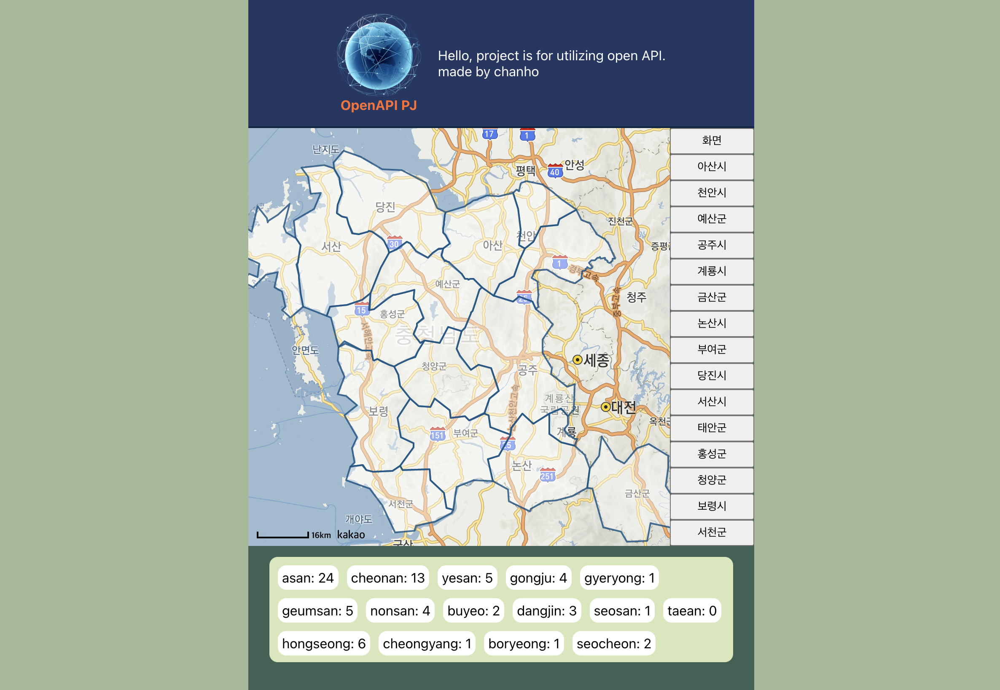
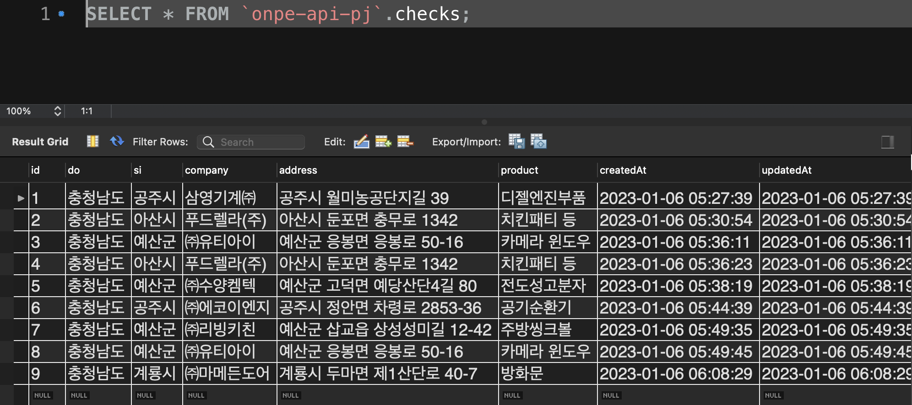

# Open_API_MAP_Project

<br>

## 😊 프로젝트 소개

### [ 공공데이터포털(OpenAPI) 및 카카오맵 API 활용 웹어플리케이션 ]

<br>

<p>
공공데이터포털의 '충청남도_유망 중소기업 현황' OpenAPI데이터 활용 및 카카오맵 API를 활용한 웹 어플리케이션으로 클릭 이벤트를 활용한 성별 및 연령별 관심 도시 및 회사의 통계를 추출을 목적으로 가진 어플리케이션

</p>

## 👐 기술 스택

<div align=center>

<h1>📚 STACKS</h1>

<div align=center> 
  
  
  
  <br>
  
  
  
  
  <br>
</div>
</div>

<br>

## 🏃 Preview 및 동작

---

<br>

- 기본 인적사항 확인 페이지

<br>



<br>

```

: 기본적인 인적사항을 클릭 후[ Go ] 버튼 클릭시 DataBase에 채크 된 인적사항을 저장 한다. <br>

1. 성별, 연령별 관심있는 지역과 관심있는 회사의 통계를 내기 위해 사용 한다.

```

<br>

- mySQL 저장 데이터



<br>

- 메인 페이지

<br>



<br>

```
공공데이터포털의 openAPI에 대한 'json' 데이터를 불러온 후 도시별로 구분하여 분류하고 카카오맵 API 에 정보를 넘겨 마커를 생성
```

<br>

- 메인 페이지 동작 1

<br>

<div align=center>


</div>

<br>

```
1. 충청남도 좌표를 이용하여 카카오맵에 폴리곤 영역을 생성
2. 폴리곤을 클릭시 해당 지역의 강소기업을 마커로 표시
3. 우측 버튼을 클릭시 해당 지역의 강소기업을 표시하도록 하며, 화면 버튼 클릭시 초기화 한다.
4. 지역을 이동시 기존 마커를 제거 하고 현 위치에 대한 마커를 새로 생성한다.
```

<br>

- 메인 페이지 동작 2

<br>

<div align=center>


</div>

<br>

```
1. 마커를 클릭시 infowindow 를 생성하여 기업의 기본 정보를 표시
2. 다른 마커를 클릭시 기존 infoWindow를 제거후 선택 마커의 infoWindow를 표시
3. 특정 회사 클릭 후 [관심] 버튼 클릭시 DataBase에 해당 기업 정보 저장 및 유저와의 연관관계 생성
```

<br>

- mySQL 저장 데이터

<br>




<br>

- 인적사항이 없을 시 동작

<br>

<div align=center>


</div>

<br>

```
1. 인적사항을 체크 하지 않고 url을 통해 main페이지 접근 시 인적사항 체크 페이지로 이동 하여 접근 할 수 없음
2. 새로고침시 첫 화면으로 이동 및 인적사항 초기화
```
